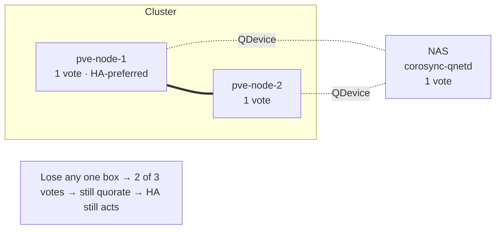
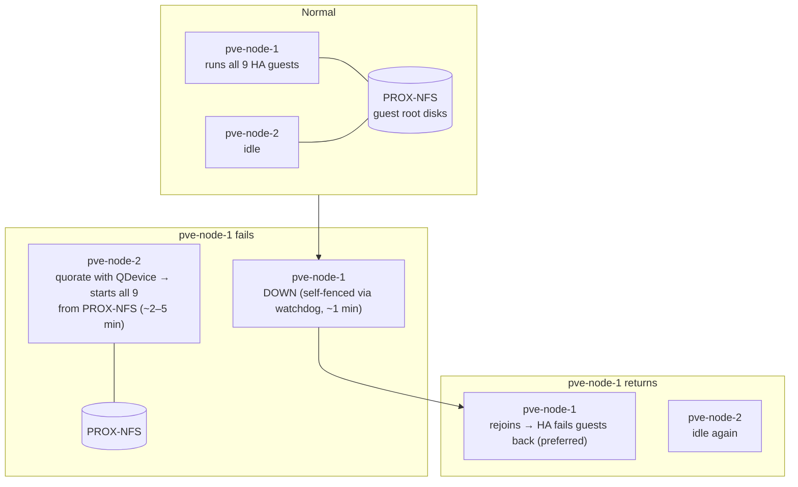

# Cluster, quorum & HA diagram

How the 2-node cluster stays quorate and how guests fail over. See
[`docs/high-availability.md`](../docs/high-availability.md).

## Quorum — 3 votes across 3 boxes

## Normal state vs. node failure

Failover works because there is only ever **one copy** of each guest disk, on NFS, and
both nodes mount it — no replication, no sync lag. The cost is that the NAS is a shared
single point of failure; see [`docs/storage.md`](../docs/storage.md).
