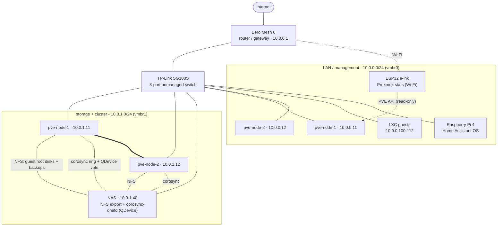

# Network diagram

Logical topology. Addresses are sanitised: `10.0.0.x` = LAN / management,
`10.0.1.x` = storage + cluster. See [`docs/networking.md`](../docs/networking.md).

Legend: solid = data path, dotted = cluster / control traffic, `===` = corosync between
the two nodes.
